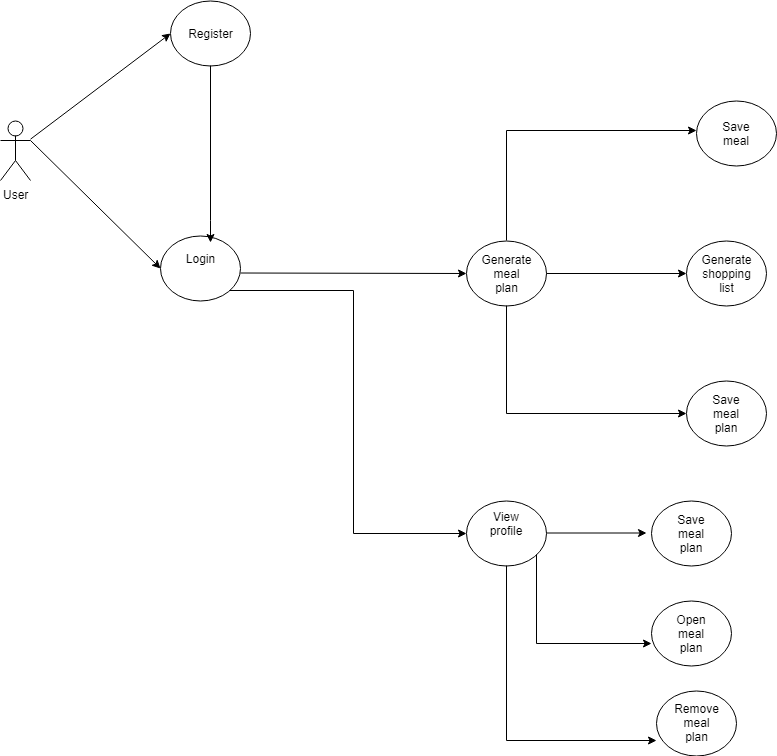
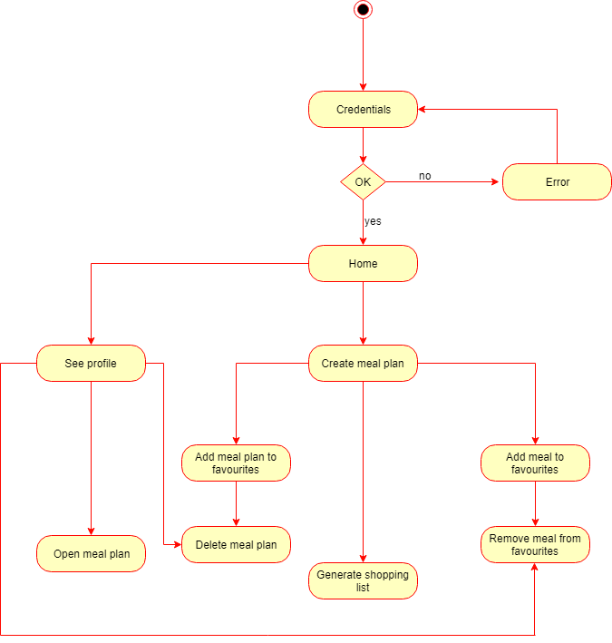
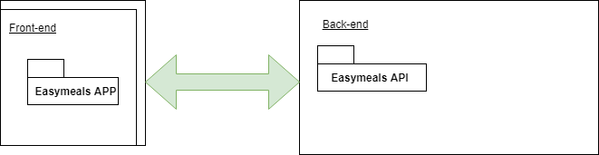
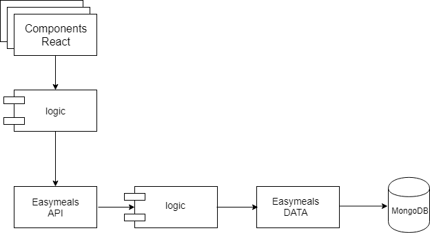
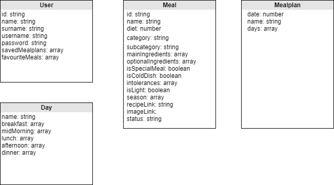

* Easymeals App

## Introduction
This application lets you generate a random week meal plan and shopping list of ingredients. You can add the meal plan to your favourites list, consult it and remove it. You can also save favourite meals and remove them from your favourite list.
It was developed as a full-stack project for the Skylab Coders bootcamp (Barcelona, 2018). The objective was to apply the following technologies in a real-life application:

- HTML
- CSS
- JavaScript (ES6)
- React
- React Router
- MD Bootstrap React
- Mongoose

## Functional description
Use cases diagram
To use this application the user needs to register and login. The application lets the user generate, save and access a week meal plan of random meals. The application also generates a shopping list with main and optional ingredients to follow the meal plan. In addition, the user can add favourite meals to a list of favourites and delete them later on.

## Activity diagram
The application has two main functions: generating a meal plan and generating a shopping list from a meal plan. With regard to the favourites list, you can add, consult and delete saved meal plans as well as all add to/ remove singular meals from a list of favourite meals.

## Technical Description
The front end of the application was built using React. The back end is connected to a database using Mongoose. 

## Components Diagram
The application has a number of react components, the business logic and a database.

## Sequence Diagram
The most significant task of the application is the generation of a meal plan which is connected to the database through a search function.

# Data Diagram

The logic has four components: 1) meal plan, 2) day, 3) meal and 4) user. A meal plan is represented by a date, a name and an array of type day components. A day is represented by a name of the day and five arrays of type meal components corresponding to several meals in a day (breakfast, mid morning snack, lunch, afternoon snack and dinner). A meal is represented by a number of fields such as name, diet, category, subcategory and intolerances, among others. A user is represented with a name, surname, username and password and several arrays embedded such as favourite meal plans and favourite meals.

